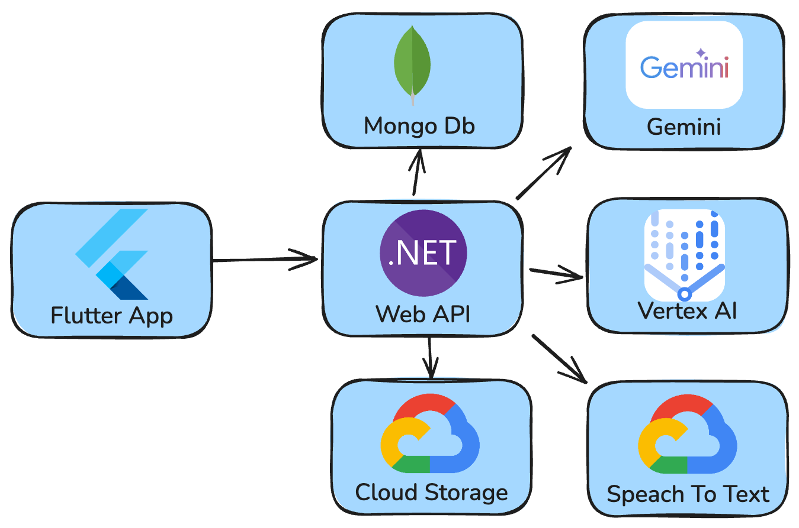
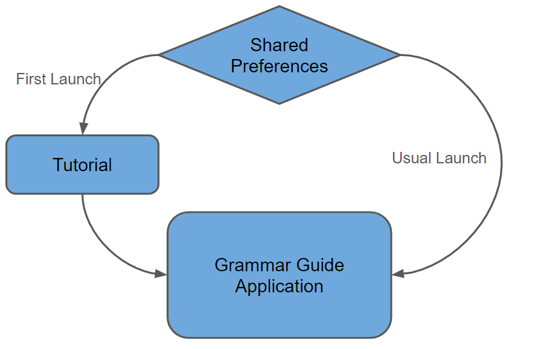
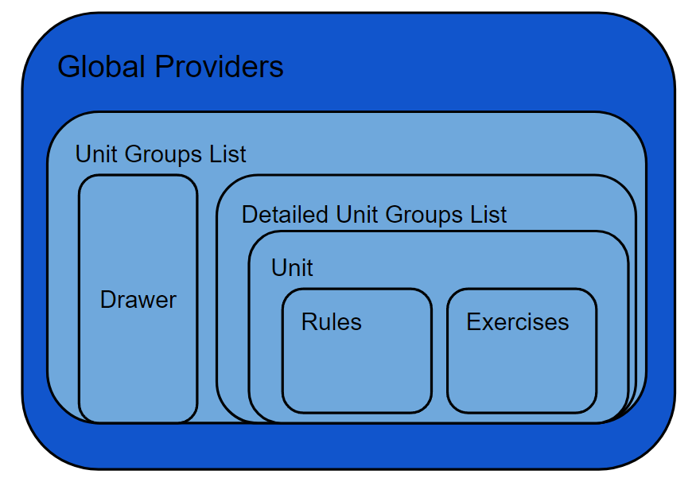

## Grammar Guide


### Purpose

**Grammar Guide** is an AI-driven language learning app designed to test and showcase the capabilities of large language models (LLMs) in a practical application. Utilizing .NET Web API, MongoDB, and Google Cloud services (Gemini for content, Vertex AI for images, Cloud Run for hosting), it delivers a seamless, scalable user experience. Built with Flutter, the app ensures consistent performance across mobile and web platforms, offering personalized grammar lessons powered by advanced AI technology.
### Features

**Guides** are AI-generated learning materials, each containing 48 units that cover basic and intermediate grammar rules. Once a user selects a guide, they can access the content of each specific unit. Each unit includes:

- Definitions of the unit's grammar rules (up to 5 rules per unit).
- Examples illustrating each rule.
- Images demonstrating the examples.
- Audio for pronunciation of the examples.
- **Supported languages**: English, Spanish, French, German, Italian, Chinese, Japanese, Portuguese, Dutch, Turkish, Polish, Latvian, Lithuanian, Hindi, Hebrew, and Russian.

The application supports four types of exercises to test knowledge of specific grammar rules:

- **Yes/No Questions**: Test your knowledge by determining if statements are correct or incorrect.
- **Pick an Option**: Choose the correct answer from given choices.
- **Text with Options**: Select the appropriate options to complete sentences.
- **Pick the Order**: Arrange elements in the correct sequence to form proper structures.

In addition to AI-driven content, the app offers several useful features:

- **Dark and Light Themes**: Customize your viewing experience with your preferred theme.
- **Track Unit Completion**: Easily monitor your progress through each unit.
- **Track Exercise Completion**: Keep track of your performance on exercises.
- **Bookmark Units**: Save and revisit important units for future reference.

### Technology Stack

- **Flutter**: Powers the development of a high-performance, cross-platform mobile application.
- **Gemini AI**: Generates customized units and exercises.
- **MongoDB**: Manages content data storage.
- **Vertex AI**: Handles image generation.
- **Cloud Run**: Deploys the backend infrastructure.
- **Google Text-to-Speech**: Provides pronunciation capabilities.
- **Google Cloud Storage**: Stores audio and image files.
- **.NET Web API**: Serves as the backend service application.

### Running instructions

To run the application, both the backend and client components must be operational. The backend relies heavily on Google Cloud components, necessitating a Google Cloud account.

#### Backend Configuration

##### Prerequisites

1. **Google Cloud Account:** Ensure you have a valid Google Cloud account.
2. **Enabled Services:** Confirm that the Vertex AI API is enabled in your Google Cloud project.

##### Steps to Configure the Backend

1. **Create a Google Cloud Application:**
    - Navigate to your Google Cloud Console.
    - Create a new application and obtain the cloud configuration JSON file.
    - Replace the existing `ai-app.json` file in the backend root folder with your downloaded JSON file.

1. **Update the `appsettings.json`:**
    - Obtain your **Gemini Access Key** from Google AI Studio.
        - Update the `AppSettings.GeminiApiKey` field with your access key.
    - Deploy a MongoDB database.
        - Insert the connection string into the `DbSettings.ConnectionString` field.
    - Create a Google Cloud Storage bucket.
        - Fill in the following BlobSettings properties:
            - `ProjectId`
            - `LocationId`
            - `PublisherId`
            - `BucketName`

##### Running the Backend

Once the above configurations are completed, you can start the backend application.

#### Client Setup

1. **Open the Flutter Project:**
    - Navigate to the "client" folder of your project.
    - Build the APK file or run the web version of the application.

### Implementation Details

#### Backend

This diagram illustrates the high-level architecture of our Flutter app and its interactions with various backend services. The app interfaces with a .NET Web API hosted on Cloud Run. The Web API communicates with MongoDB for content storage, Gemini for content generation, and Vertex AI for image generation. It also utilizes Cloud Storage for saving audio and image files and integrates with Speech-to-Text for audio-to-text conversion. This architecture enables our Flutter app to leverage robust backend services, ensuring a seamless and powerful user experience.


	
#### Client Application

Client application is available as on mobile platforms and as a web app. To easily support multiple platforms it is built using Flutter framework. It also provides consistent design for all the platforms that follows Material Design guidelines with support of dark/light theme out of the box.
For a smooth user experience, application provides a tutorial screen on a first launch that shares some tips about app and perform initial configuration like choosing your first guide to learn.



Application starts with a list of all the groups of units available for the current guide. Then each screen provides more and more detailed view down to specific topic with rules and exercises.
User could also configure application using Navigation Drawer from the main screen.
This application heavily utilize [provider](https://pub.dev/packages/provider) package. It is a simple and robust way to share data or events between different views and screens.



#### AI Content generation

Let’s take a closer look at one of the most intriguing aspects of the app — how it interacts with Gemini. When a user opens a unit or exercise, the PromptBuilder creates a prompt based on the guidelines from _Prompting Guide 101_. The prompt includes:

- **Persona**: English Tutor
- **Task**: Prepare materials to teach a unit titled X.
- **Context**: Specify the unit by dividing the materials into 5 rules and providing examples for each.
- **Format**: The output should be in JSON.

This prompt is then sent to Gemini. To optimize performance, requests are cached, so content is generated only once and on-demand. Gemini’s response is deserialized, transformed for the app's UI, and stored in the database, ready to be delivered to the user.

####  AI Content generation. Sample prompt

*Create a Unit for English - Spanish Guide for the Unit with the title ‘Unit 5 Definite and Indefinite’*

The final prompt will be like: 
"You are a professional language tutor specialized in teaching polish language. You need to prepare grammar learning materials for the unit with the title 'Using Questions Words'. The materials should be divided into rules consist of at least 3 and up to 5 rules. The response should include a comprehensive list of these rules with grammar explanations. Ensure each rule is precise and can be distinctly assessed. For pronunciation rules, add and highlight placeholders. Make rule definitions as clear as possible. 'Content' field is the detailed rule definition.'Example' is one sentence the text in polish language which demonstrates the rule using native language symbols. 'ExampleTranslation' is the translation of 'Example' sentence in english language. The output format must be a valid JSON object. It should not contains characters which can not be in JSON. All fields of json must be defined. The example of the output is:
```
{
    "Title":"Spanish Grammar Basics",
    "Rules":[
      {
         "Title":"Subject-Verb Agreement.",
              "Content":"The subject and verb in a sentence must agree in number.",
          "Example":"El perro corre rápido.",
         "ExampleTranslation":"The dog runs fast."
      },
       {
         "Title":"Use of Articles.",
              "Content":"Articles are used to define a noun as specific or unspecific.",
              "Example":"Ella compró un libro.",
          "ExampleTranslation":"She bought a book."
      }
   ]
}
```

#### AI Image generation

For each rule in a unit or a specific exercise it is possible to generate an image based on provided text. For the rule it is 'Example' text, for the exercise - 'Question'. At the beginning this text is going to PromptExecutor with the following prompt:
"Create a one sentence Google VertexAI prompt for a pencil drawing with transparent background. The prompt must shows the process or action from the following text: {text}". The response would be a valid prompt to Vertex AI to generate stylish image, with the provided context.

#### AI Image generation. Example 

Consider the following example for the rule **"I am not walking to the store."**

1. **Initial Gemini Request:**
    
    _Create a one-sentence Google Vertex AI prompt for a pencil drawing with a transparent background. The prompt should depict the process or action described in the following text: "I am not walking to the store."_
    
2. **Possible Response:**
    
    _"Draw a pencil sketch with a transparent background of a person walking toward a store."_
    
3. **Final Image:**
        
	


### Conclusion

The Grammar Guide project leverages advanced tools like Google Gemini, Vertex AI, .NET Web API, and MongoDB to quickly create a scalable, personalized language learning platform with high-quality content and a seamless user experience.